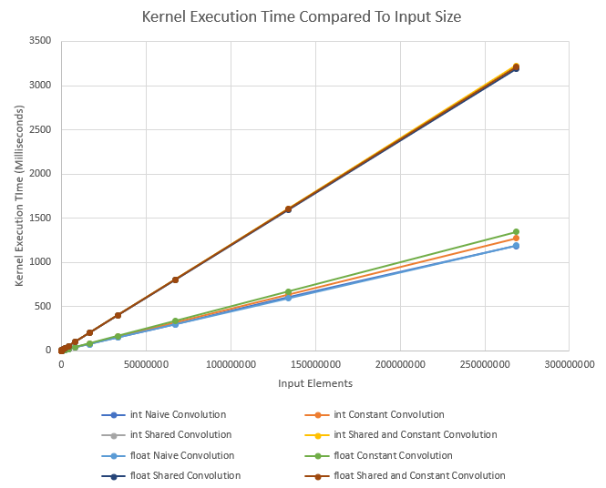

# Cuda Convolution Benchmark #

This program benchmarks the kernel execution time of different convolution implementations. Convolutions are useful in many 

## Function Templates
This project uses templates to generate Cuda kernels. Template functions are generic functions that are compiled into regular statically typed functions. They typically are used for making code dynamically typed (at compile time).

    //Generic Function in Convolution.h 
    Result<T> CudaPerformConvolution<Type, constsize>(input, filter, kernel);
	
	//Specific Function implementations
    Result<int> r = CudaPerformConvolution<int>({1,2,3,4,5}, {1,2,3}, getKernels<int>()[0]);
    Result<float> r = CudaPerformConvolution<float, 3>({1.,2.,3.,4.,5.}, {1.,2.,3.}, getKernels<float>()[1]);

## Benchmark

The benchmark tests the following algorithms:

 - Naive Convolution
 - Constant Convolution
 - Shared Convolution
 - Shared and Constant Convolution

It also tests each of these algorithms as both Integers and Floating Points. Since the kernels were implemented as generic templates, any type can be passed in, but only integers and floating points are tested.

The input size starts at 1 and doubles each iteration.
The masks/filter size is half of the input size until it reaches the maximum size that will fit in constant memory. Once it reaches that size, it will not grow anymore.  

## Results
The results are saved as a csv file called *kernelperformance.csv*, and are also output to the console when in benchmark mode.

To no surprise the floating point versions of the algorithms were faster than their integer counterparts. The fastest algorithm was the one that utilized both shared and constant memory.